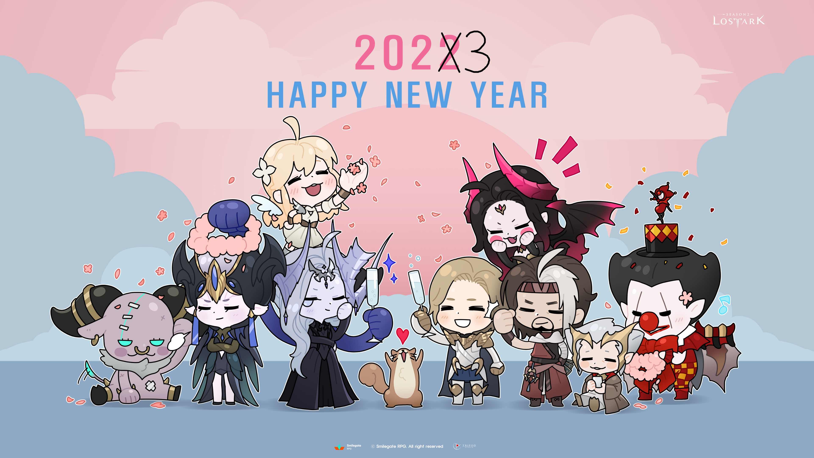

### 템레벨 랭킹


| # | 닉네임 | 아이템 레벨 |
|:-:|:-|:-|



|{{ranking}}
|{{member.name-}}
|{{member.itemLV-}}|


<a href="{{ '/docs/ranking/' | relative_url }}" class="more">랭킹 더보기 ></a>
{: .text-right .fs-2 }

### 주간 템레벨 변화






| # | 닉네임 | 아이템 레벨 변화 |
|:-:|:-|:-:|


  
  
  
  
  |{{ranking}}
  |{{after.name-}}
  |{{before.itemLV}} > {{after.itemLV-}}|


<a href="{{ '/docs/chart/weekly_chart/' | relative_url }}" class="more">주간 템레벨 변화 더보기 ></a>
{: .text-right .fs-2 }

### 캐릭터 가치 환산


| # | 닉네임 | 가치 |
|:-:|:-|:-:|



|{{ranking}}
|{{capitalization.name-}}
|
|


<a href="{{ '/docs/capitalization/' | relative_url }}" class="more">캐릭터 가치 환산 더보기 ></a>
{: .text-right .fs-2 }

### 강화 재료 가격


| 재료 | 가격 |
|:-:|:-:|
|정제된 파괴강석|{{material["정제된 파괴강석"]}}|
|정제된 수호강석|{{material["정제된 수호강석"]}}|
|찬란한 명예의 돌파석|{{material["찬란한 명예의 돌파석"]}}|
|최상급 오레하 융화 재료|{{material["최상급 오레하 융화 재료"]}}|
|명예의 파편 주머니(소)|{{material["명예의 파편 주머니(소)"]}}|
|명예의 파편 주머니(중)|{{material["명예의 파편 주머니(중)"]}}|
|명예의 파편 주머니(대)|{{material["명예의 파편 주머니(대)"]}}|
|7멸|{{material["7멸"]}}|
|7홍|{{material["7홍"]}}|
|9멸|{{material["9멸"]}}|
|9홍|{{material["9홍"]}}|
|10멸|{{material["10멸"]}}|
|10홍|{{material["10홍"]}}|

